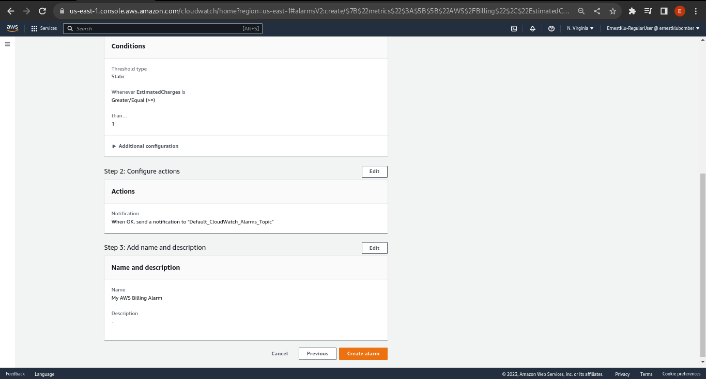

# Week 0 — Billing and Architecture

This journal details the processes I went through to complete the first bootcamp project.
I will mostly be demonstrating using photos cropped from my personal AWS account and some AWS CLI code if need be.

## Creating an IAM Admin User

- Log in to AWS account using the root user.
- In the search box in the management console type `IAM`, click on  "IAM" under the "Services tab". 

- Under "Access Management", click on `User groups`. On the `User groups` page, click on `Create group`. Of course I already have an admin account but I'll be creating a new one. 
- On the `Create user group` page, Enter a name in the `User group name` box,  scroll down to the `Attach permission policies - Optional` tab and type `AdministratorAccess` in the filter policy box to to filter the policies. Search for and check the box beside the policy `AdministratorAccess` to select it. 
- Click on `Create group` to finalize the group creation.
- Now on to create a user to put in the group. Any user put in a group inherits all the policies that the group possesses.
- Under `Access Management`, click on `Users`. On the `Users` page, Click on `Add users`. A page that appears having 4 steps that detail the user creation process.
- The first step: `Specify user details`. Enter the preferred user name and check the `Enable console access - optional` to allow the user to log in to the AWS Management Console with a password.
        - Opt for an Autogenerated password, and make sure the `Users must create a new password at next sign-in (recommended)` box is checked. Click 'Next'.
- The second step is to `Set permissions` for the new user. Since a group has been created, Select `Add user to group` under `Permission Options`. Under the 'User groups' tab, select the group you just created that has `AdministratorAccess`. Ignore the 'Permissions boundary' for now. Click 'Next'.
- The third step is `Review and create`. Review the information, make sure the password type is set to 'Autogenerated' and password reset it set to 'Yes'. Ignore 'Tags' and click on 'Create User'.
- The final step is to retrieve the password. You can click to show the password, download a .csv file containing the information needed or send everything as an email to a real-world user so they can log in. 
- Sign out of the root account.
- Sign in as the new user using the console sign-in password provided. Enter the provided username and password and be led to another page where you are prompted to input the old password and provide a new password to use.


## Generate AWS Credentials (Access Keys)

These credentials or access keys are used to programmatically communicate with AWS through the CLI, through SDKs or through direct calls to the AWS API.
- Log in to the newly created Admin user, search IAM in the search box and click on it to go to the IAM page.
- Under 'Access Management', select 'Users' and click on the user (not the checkbox) to be taken to the user's page. 
- On the user's page, search for and click on `Security credentials` tab. Scroll down to see the 'Access Keys' part. Click on `Create access key`.
- There are a number of use-cases for the 'Access Keys', the goal for now is to gain CLI access to AWS so pick the `Command Line Interface (CLI)` option, and click on 'Next'
        - Make sure the check box with `I understand the above recommendation and want to proceed to create an access key` is enabled.
- Set a description tag, and click on `Create access key`. 
- Retrieve the access keys, read the best practices and click on 'Done'. 


## Installing the AWS CLI on a local environment

For every kind of operating system to run the AWS CLI, AWS has documentation to cater for the installation on that OS.
The documentation link: https://docs.aws.amazon.com/cli/latest/userguide/cli-chap-welcome.html
- Check the prerequisites to use the AWS CLI v2, and make sure everything is in order.
- Install the AWS CLI v2 on the preferred OS (following the documentation).
- Enable local system-wide access to AWS via the local CLI by running the command
```Bash
        $ aws configure
        AWS Access Key ID [None]:
        AWS Secret Access Key [None]:
        Default region name [None]:
        Default output format [None]:
```
- Populate this the access keys generated and any preferred values.


## Using Cloudshell

- AWS Cloudshell, is just a shell environment in the cloud on AWS.
- It comes preconfigured with access keys to the AWS account that launched it. Works just like the AWS CLI.
- The button to activate it is the bash logo tot he right of the AWS search box.


## Conceptual Design of Cruddur App

A conceptual design of the Cruddur app aka Ephemeral "Twitter" app that wil be built through the entirety of the bootcamp.

This is a link to the conceptual diagram in draw.io: [Crudddur-App-Conceptual-Design](https://viewer.diagrams.net/?tags=%7B%7D&highlight=0000FF&edit=_blank&layers=1&nav=1&title=Cruddur%20App%20Conceptual%20Design%20.drawio#R7Vxbd6I6FP41rnmqC4h4eUSkrevYjkvtzOljKlGZQeJArPb8%2BpNAuEUo2BaxTrtaSza5sfPl2zs7wQbQ1%2FsbF25Wd9hEdkORzH0DDBoK%2FZFa9B%2BTvAQSuadKgWTpWiaXxYKp9R%2FiwjDb1jKRl8pIMLaJtUkL59hx0JykZNB18S6dbYHtdKsbuEQHgukc2ofSn5ZJVoG0Gz4Fk98ia7kKW5YlfmcNw8xc4K2giXcJETAaQHcxJsHVeq8jm2kv1EtQ7jrnbtQxFzmkTIH7%2FePw2fmjbG%2Fufjiru18u6iyuWp2gmmdob%2FkT896Sl1AFSxdvNzwbcgnaZykePoXZpcOOydHjUqAgvEbEfaFZeEVXSpeX4SC5ipS4i1Uuyy0uXCX03W5zIeTjvIyqj1VBL7g2jtAMKFbMBlsO8dtV%2B%2FRXagK1oeiS%2F6fSDLov7HWZoKnKKbmfanZkIXObjocuCIOcPTVD2o6E9Bf02fBYFLsj%2BITsMfYsYmGH9u8JE4LXNIP3G5E5U6hEEyuyphoZyImCmm0tWQGCN1QKvU0wpRbWHplMwG%2FP6cgilwp8DSDXeEaBIlhdFOcbpqD1fsk4oTm3vDmWe82t5xdZWLatYxu7vg6BJKlSB7BixMW%2FUXjHwQ5imbFDruHashkyNHe%2BsgjtkUeHYQC3FARBjTTTFG%2FdOWt1RQhlBkUFGv2gAGAfLIPXXGK8tBHcWF5zTpXBbsw9P%2Bv1ImiCXqYaUZV%2BopncGZBE%2BiuT7BD%2FHO4gC%2B1SBtgj4YeDvZUB9rZNm%2B0%2F0Ysl8R8%2FEDBlpqZB%2B88WhzeuPJ%2FAqe4lGWz2QTF%2BP6zoevL9fmbcD8IKG8EAie1QcaJtYeZRRnJMBkkfcTs2YtMN9AGwo6BLg%2FuyQcSrUbtqikMVNQNUShaDVoUppXMwbMiktpUnsUtWeIkdaBuxtB8PLGOoOM8IM0byh%2FMXIuSFOwpwS3B6sAMaCU31uQ2%2F30zQdRnwdEh5JlrArQ99CgT35V%2Bmg6YaJh%2F50%2FiJwZ4rKEi98FSgb6bkt0CLOlbQXaLXMgY28BCDLrIhsZ7TzWYBihcdM7MRY7fTStv%2FliJgMugYL5V0ccSKZKEikTA9f4gPKvLxHT3P2yGvnpBG%2B5r%2BzxeLVsyioFc3i7aLITXQZlpfmxqlxjzNj4pAnoLrtrDxbr6CLmmakHr40EM5ODkncIgcWxlYeiLbtDLAArL8OLkqtMhyHTY3tldJa5UwXjn2yk%2BNkWvRh2dD5wvPH0pvN7Be2OUCA1JoiNsfYYc114UviQx8OZtrprsi3oEQcCjK31MFgAc9%2BFAT3P1ME%2BCvxnpZp7P1Tqy%2Fi1B7tcBpb5EITfQ6ASaairHEEiku%2FYJgNRBU64RgiQgtcS3oLO087%2BxMvXhxuE3LpdmCiOUOebH7WoHvFjn2oaMvH%2Fpu7QzXrVuZ5yYVO%2Fqj7xqVS31tpN3rxiS67x616qOqJGlQHIR1xXDw2jLNgNoQXZnyUL8Uxn%2BjCDgLQTM28%2Fig5kZ1EyHgRKBXDIwU4rQ6dLQFdGQtA7M8e1AZPLrFLIAcU2M7Xmwkbeh51twfALp8C8Vc2YmhT9uqzxU8e2uYLDKvkUl9TFrUTPNauSmSe%2B9zhxLIVDOAGcreGalT1fTEUMW4R06A7aCitiRUJC6Jc0J%2BH7VMULLoNn8%2B8YmTmkzxHPuaT%2Bc3n8qupIN5V9d8ardy4o1HzyexohPPp5C%2BPjT0reaEvrXx8D1h7y8HqNABaisCnIB64ABlHceozP8JH%2BwkWyt3xnSq3bB4Olyz9ZPz5G0S9cf%2B9tSY%2FBjqxquO%2BNHwDIPwLOTuEex%2B4lWd2sjb4qwMuT0pjVy5k%2BG6Z0G3spWdUnNI8jhj%2Frlclpz9c%2B6QhLG0MvGzyh2S0MEs3mTPOS13mmhT2M3XiFbX9Nvh%2Fc3b%2BPACt6PLobIyyut00msppfZNa6V9TpQXk9zlUl719AVK0let2zVhL19jr4mhja5mw7sMmho%2F9EfD6Re3nQ%2B3iQdy6qc2tVZqkxtH7e5dArWdZXgpehel0JsDdfIhyIhqnm7%2F%2Bhj%2F%2BxKQWjnqQFnU5ZDqiUBXIlajPcxujfvZUNdmw%2B%2F3HxNpKQ6prNAeLtn%2Bcn%2BTOHXGpdFBNKWEhWYvxEzjKN9nxWoFFluRinfWM012ZQEYAOpdjfx9Jrt6IizJg6DWWAoo8T7A1NAm%2Bu3XcuM8yEsV9j1UUPd6A5Q4%2FlV88OPi9qoLX5xS3riF3TmjRQYou4mdcz7xRGdChLe3VHETsOwetiqcyWuJHkHFe9itEq98eztrbcP4MAjH5DmfpK1hE07OePm018uizcp4s1XC9uqTh8HgYUJzaeMx%2Fbyif8b41rgzJtqIXn%2Bb%2FRzOZsbk22UcK1CPAemHoiUnBhLuX6SnfcZ6IVpDnOSsQavEO3cP08s9f1sfTl7%2FnoSWdHgIJeuM9huAQZPxF7EE9iT%2BPhtg%2FA8%3D)


## Logical Design of Cruddur App

A logical design of the Cruddur app with the AWS resources/services that will be used to build it.

Link to Cruddur logical design: [Crudddur-App-Logical-Design](https://t.ly/k2Wj)

## Creating a Billing Alarm

Enabling billing alerts will make it easier to track and manage the spending within your AWS account. Billing alerts can help prevent unexpected spend increases.
- Log in to the root AWS account or an IAM account that has access to billing information.
- Search "Billing" in the AWS search bar and click on it.
- Under "Preferences", click on "Billing Preferences", find and click on "Receive Billing Alerts" and save preferences. 
- Search "CloudWatch" in the address bar and go to its page. On the page, click on "Alarms" and click "Billing". If "Billing" does not appear, change regions to `N.Virgina` and try again. Create an alarm. 
- Specify the metrics and conditons. Under Conditions, select preferred threshold type, define when the alarm should alert you and set a dollar value for the threshold value. 
- Configure the actions CloudWatch should take to trigger the alarm. "Create a new topic" so as to allow CloudWatch to send notifications to a trusted email. 
- Set a name and description for the alarm. 
- Preview and create the alarm configured. Click "Create Alarm". 
- After creating a topic and a trusted email to send notifications to, Enable the SNS Confirmation by going to Amazon SNS page and selecting Subscriptions. 
- Request confirmation of this email and follow the instructions to confirm the SNS subscription and the billing alarm.  


## Creating an AWS Budget

Budgets are created to track AWS costs and resource/service usage. Once the Budgets are set-up, you can monitor AWS spend and take action on them.
- Log in to the management account used in AWS.
- Type "Budgets" in the search box and selct "AWS Budgets". 
- In the AWS Budget page, click on "Create a budget".
- Choose whether to use a Template to create the budget or customize the budget to suit your preference.
  Going with Template as it gives the recommended configs sufficient for a budget.
  Choose the kind of template to use (I'm creating a Zero spend budget), provide the name and email address and click on "Create budget". 
- Your budget is now ready to trigger when the spend thresholds are reached. 
- I deleted the UI walkthrough version and re-created the budget using the AWS CLI using my Gitpod account.
- I added an `aws/json` folder that contained the json files for creating the budget with an SNS nofitication.
``` Bash
aws budgets create-budget \
    --account-id $AWS_ACCOUNT_ID \
    --budget file://aws/json/mybudget.json \
    --notifications-with-subscribers file://aws/json/my-notifications-with-subscribers.json
```


# HomeWork Challenges

## 1. Logical CI/CD Pipeline for Cruddur App
To the best of my ability, I came up with a logical design of how the CI/CD pipeline of Cruddur app will be like, if to be deployed on AWS with AWS services or resources. 

## 2. Reviewing Cruddur App using the Well-Architected Tool

After reviewing my app through all the pillars of the Well-Architected Framework, I got a high-risk app deployment plan. I might have to work on improving it to make it less risky. 
- Here's a link to the report generated: [Cruddur Well-Architected Tool Report](assets/Week0/TaskMasterErnest-Cruddur-App_wellarchitected.pdf)

## 3. Hook EventBridge up to SNS

- I created a EventBridge rule that links with Amazon SNS service to alert me when an even occurs with my AWS services.
- I used this documentation to help me through the process, [EventBridge Setup Process](https://docs.aws.amazon.com/eventbridge/latest/userguide/eb-get-started.html)


