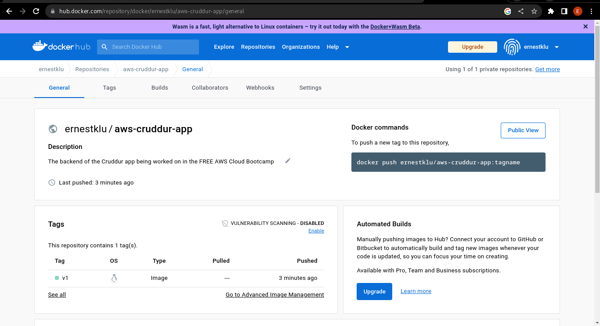

# Week 1 — App Containerization

## Running the Python Backend Locally
- Test the Python backend code to see it its running locally
- Set the backend and frontend URLs so that we get some information.
- The backend returns a json file so watch out for that.
	```Shell
	# enter the backend directory
	cd backend-flask
	# set the enviroment variables
	export FRONTEND_URL="*"
	export BACKEND_URL="*"
	# install all dependencies
	pip3 install -r requirements.txt
	# run the python code with the flask module, set the host IP 
	flask run --host=0.0.0.0
	```
- To access the information the backend is putting out in JSON, append `/api/activities/home` to the end of the URL the Flask server is running on. eg, `http://127.0.0.1:5000/api/activities/home`
- Uninstall the dependencies installed using `pip3 uninstall -r requirements.txt -y `.

### Creating a Dockerfile
- A Dockerfile is a configuration document that lists all the commands that Docker runs in order to create a container for a specific application.
- Create a file called `Dockerfile` in the `/backend-flask` directory.
- Add the following code to the Dockerfile:
	```Dockerfile
	FROM python:3.10-slim-buster

	WORKDIR /backend-flask

	COPY requirements.txt requirements.txt
	RUN pip3 install -r requirements.txt

	COPY . .

	ENV FLASK_ENV=development

	EXPOSE ${PORT}
	CMD [ "python3", "-m" , "flask", "run", "--host=0.0.0.0", "--port=4567"]
	```

### Build the Container
- Building a container is to create a necessary environment that contains all the dependencies the application will need to run successfully.
- See it as creating a perfect local environment for running an application.
- Build the container image from the Dockerfile with the tag, backend-flask, using this command
	```Bash
	docker build -t backend-flask .
	```
- It is important to run this command directly in the directory where the Dockerfile is situated; in this case, `/backend-flask` dir.

### Run the Container
- Running a container is starting it, essentially starting the environment in which it was built.
- With Docker, there are soo many ways to run a container. For this container, we are going to add a few flags taht are useful to run it:
	1. ensure container is removed when stopped with the `--rm` flag.
	2. add ports for container to use with the `-p` flag.
	3. add environment variables to use in container with `-e` flag.
	4. ensure container is running in background with the `-d` flag.
- The command to run the container turn out like this;
	```Shell
	docker run --rm -it -d -p 4567:4567 -e BACKEND_URL="*" -e FRONTEND_URL="*" backend-flask
	```
- You specify the image you want to run as the container at the end of the `run` command eg. backend-flask.

## Running the Frontend Locally
- Testing the frontend to check if it will run locally.
- In this test, make sure you have node and npm installed on local machine.
- The frontend should return the Cruddur app page.
	```Shell
	# install nodejs and npm
	curl -sL https://rpm.nodesource.com/setup_16.x -o nodesource_setup.sh
	bash nodesource_setup.sh
	dnf install nodejs
	# check node and npm versions
	nodejs -v
	npm -v
	# enter the frontend-react-js directory
	cd frontend-react-js
	npm install
	npm run start
	```
- Access the information the frontend is putting forth by clicking the URL offers. `http://127.0.0.1:3000`.
- Clear the local environment of the dependency modules installed by npm, by removing the node_modules package and package-lock.json package. 
	```Shell
	rm -rf node_modules
	rm package-lock.json
	```

### Writing the Dockerfile
-  Create the Dockerfile in the `/frontend-react-js` directory
- Add the following to the Dockerfile:
	```Dockerfile
	FROM node:16.19

	WORKDIR /frontend-react-js

	COPY . /frontend-react-js

	RUN npm install
	
	ENV PORT=3000
	
	EXPOSE ${PORT}
	
	CMD ["npm", "start"]
	```
	
### Build the Container Image
- Still in the `/frontend-react-js` directory, build the Docker image.
- Use the preferable tag `frontend-react-js` to build the image.
	```Shell
	docker build -t frontend-react-js .
	```

### Run the Container
- After building the container image, run the container to get the application working
	```Shell
	docker run -d -p 3000:3000 frontend-react-js
	```

## Docker Compose
- Docker Compose is a tool for defining and running multi-container application in Docker.
- It is a way to document and configure all the applications' service dependencies.
- These configurations are written in the YAML format.
- With this tool/plugin, a single command will pull, build and start containers for each dependency stated.

### Creating the Docker Compose file
- Go to the root of the application; out of any directory and into the root directory of where all the application code is documented.
- Create a `docker-compose.yml` file.
- Add the following code into the `docker-compose.yml` file. NB: We are working in the Gitpod workspace provided in the GitHub workspace.
	```YAML
	version: "3.8"
	services:
	  backend-app:
	    environment:
	      FRONTEND_URL: "https://3000-${GITPOD_WORKSPACE_ID}.${GITPOD_WORKSPACE_CLUSTER_HOST}"
	      BACKEND_URL: "https://4567-${GITPOD_WORKSPACE_ID}.${GITPOD_WORKSPACE_CLUSTER_HOST}"
	    build: ./backend-flask
	    ports:
	      - "4567:4567"
	    volumes:
	      - ./backend-flask:/backend-flask
	  frontend-app:
	    environment:
	      REACT_APP_BACKEND_URL: "https://4567-${GITPOD_WORKSPACE_ID}.${GITPOD_WORKSPACE_CLUSTER_HOST}"
	    build: ./frontend-react-js
	    ports:
	      - "3000:3000"
	    volumes:
	      - ./frontend-react-js:/frontend-react-js
	
	# the name flag is a hack to change the default prepend folder
	# name when outputting the image names
	networks: 
	  internal-network:
	    driver: bridge
	    name: cruddur
	```
- The services represent the containers that will be run; with their environment variables and ports.
- If the images are not already built or present, the `build:` command specifies which directory to enter and build the image from.
- the `volumes:` command is to link a storage area on host machine to a place in the container.
- the `networks:` section creates a network named `cruddur` that links both containers so that they can share information in the same network.
.
.
.
.
# HOMEWORK CHALLENGES

### 01. Running CMD from an external script
- The goal is to write the script in a file and reference that script in the code to run it
- Open a new `.sh` file preferably in the same directory as the Dockerfile, name it `run-flask.sh`. Add the code to run when referenced in the file as shown:
	- this is how to run a flask module without the `python3 -m` preamble
	```Shell
	#!/bin/bash
	flask run --host=0.0.0.0 --port=4567	
	```
- In the Dockerfile where the external script is to be referenced, change the configuration code to match this.
	- the `chmod +x ./run-flask.sh` code enables permissions for the user to run the file.
	- the `ENTRYPOINT` command makes sure the command in the [] is the first command to run when the container is run
		- an alternative is to use the `CMD [ "bash", "./run-flask.sh" ]` in place of the `ENTRYPOINT` command.
```Dockerfile
FROM python:3.10-slim-buster

WORKDIR /backend-flask

COPY requirements.txt requirements.txt

RUN pip3 install -r requirements.txt

COPY . .

ENV FLASK_ENV=development

EXPOSE ${PORT}

RUN chmod +x ./run-flask.sh

ENTRYPOINT [ "./run-flask.sh" ]
```
- Build the image with the `docker build` command and test run it with the `docker run` command with the necessary flags.


### 02. Pushing an image to DockerHub
- Go to DockerHub, create an account and sign in (remember the password and username).
- Create a new repository in DockerHub; could be a public repo or private repo.
- Spell out the name you want for the repo.
- Go to the command-line and set the DockerHub username and password as environment variables.
	- a safer way would be to use Docker Secrets.
	```Shell
	export DOCKER_USERNAME="username"
	export DOCKER_PASSWORD="password"
	```
- To push an image, you must build it and have it present on the local machine.
- You must then tag the image in the way that matches the repo it will be sent to with the `docker tag` command.
	- ie. `image_name:tag` to `docker_repo_name:tag` 
	```Shell
	docker tag backend-flask:latest ernestklu/aws-cruddur-app:v1
	```
 
- Log in to Docker from the local machine using the `docker login` command.
	- echo the password to the `docker login` command to make sure the password is not persisted on the CLI.
	```Shell
	echo $DOCKER_PASSWORD | docker login -u $DOCKER_USERNAME --password-stdin
	```

- Use the `docker push` command with the name of the preferred image (with the right tag) to push it to the docker repo in DockerHub.
	```Shell
	docker push ernestklu/aws-cruddur-app:v1
	```
	

## 03. Multi-stage build of the Dockerfile(s)
1.
- Multi-stage builds are meant to reduce the size of an image that will be put into production.
- Create a new file called `Dockerfile.dev` in the `/backend-flask` folder in the repo.
- Cut down on the size of the build by using `python3:10-alpine` as the base image.
	```Dockerfile
	FROM python:3.10-alpine
	
	WORKDIR /backend-flask
	
	COPY requirements.txt requirements.txt
	
	RUN pip3 install -r requirements.txt
	
	COPY . .
	
	ENV FLASK_ENV=development
	
	EXPOSE 4567
	
	CMD [ "python3", "-m" , "flask", "run", "--host=0.0.0.0", "--port=4567"]
	```
- The build image using this new image from 152MB to 61.3MB. 


2.
- Multi-stage building really shines when building the front-end react application.
- Create a new file called `Dockerfile.dev` in the `/frontend-react-js` directory and populate it with the code below.
	- the run `npm run build` isto create a build directory with a production build of the application.
	- the build directory contains static files of the CSS, HTML and JS scripts needed to run the application.
	- Copy the build directory from the initial build stage and then host these files in an NGINX container.
	- NGINX runs on port 80 by default, map it to any port you wish on the local host.
	```Dockerfile
	FROM node:16.19-alpine AS build

	WORKDIR /frontend-react-js
	
	COPY package.json .
	
	RUN npm install
	
	COPY . .
	
	RUN npm run build

	FROM nginx:stable-alpine
	
	COPY --from=build /frontend-react-js/build /usr/share/nginx/html

	EXPOSE 8080
	```
- The build image reduces from 1.19GB to 25MB.

3.
- Create a `docker-compose-dev.yaml` file in the root of the project directory. 
- With this new docker-compose configuration, you can leverage the multi-stage builds to create a working application on a single docker network.
	```YAML
	version: "3.8"
	services:
		backend-test:
			environment:
				FRONTEND_URL: "https://8080-${GITPOD_WORKSPACE_ID}.${GITPOD_WORKSPACE_CLUSTER_HOST}"
				BACKEND_URL: "https://4567-${GITPOD_WORKSPACE_ID}.${GITPOD_WORKSPACE_CLUSTER_HOST}"
			build:
				context: ./backend-flask
				dockerfile: Dockerfile.dev
			ports:
				- "4567:4567"
			volumes:
				- ./backend-flask:/backend-flask
	
		frontend-test:
			environment:
				REACT_APP_BACKEND_URL: "https://4567-${GITPOD_WORKSPACE_ID}.${GITPOD_WORKSPACE_CLUSTER_HOST}"
			build:
				context: ./frontend-react-js
				dockerfile: Dockerfile.dev
			ports:
				- "8080:80"
			volumes:
				- ./frontend-react-js:/frontend-react-js
	networks:
		internal-network:
			driver: bridge
			name: cruddur
	```

## 04. Adding HealthCheck configuration to the compose file
- Built upon the initial steps above, a healthcheck configuration is added to the compose file.
- This config checks whether the endpoints stated are working properly.
	```YAML
	version: "3.8"
	services:
		backend-test:
			environment:
				FRONTEND_URL: "https://8080-${GITPOD_WORKSPACE_ID}.${GITPOD_WORKSPACE_CLUSTER_HOST}"
				BACKEND_URL: "https://4567-${GITPOD_WORKSPACE_ID}.${GITPOD_WORKSPACE_CLUSTER_HOST}"
			build:
				context: ./backend-flask
				dockerfile: Dockerfile.dev
			ports:
				- "4567:4567"
			healthcheck:
				test: curl --fail -s http://localhost:4567/api/activities/home || exit 1
				interval: 30s
				retries: 5
				timeout: 30s
			volumes:
				- ./backend-flask:/backend-flask
	
		frontend-test:
			environment:
				REACT_APP_BACKEND_URL: "https://4567-${GITPOD_WORKSPACE_ID}.${GITPOD_WORKSPACE_CLUSTER_HOST}"
			build:
				context: ./frontend-react-js
				dockerfile: Dockerfile.dev
			ports:
				- "8080:80"
			healthcheck:
				test: curl --fail -s http://localhost:8080/ || exit 1
				interval: 30s
				retries: 5
				timeout: 30s
			volumes:
				- ./frontend-react-js:/frontend-react-js
	networks:
		internal-network:
			driver: bridge
			name: cruddur
	```
